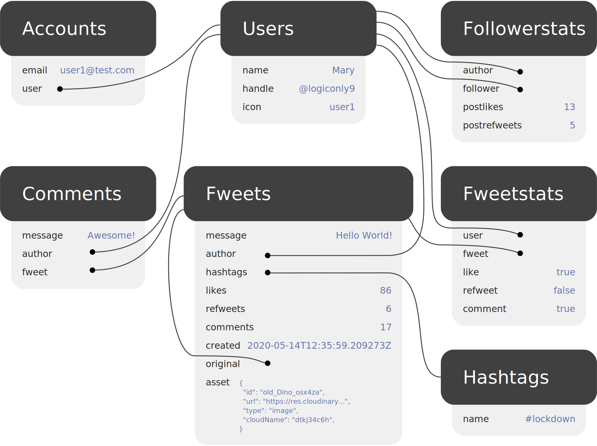

# Twitter Clone

I'm learning Rust. The first version of this project was just a basic CRUD application to create a REST API connected to a SQL database following this [tutorial](https://hub.qovery.com/guides/tutorial/create-a-blazingly-fast-api-in-rust-part-1/).

Now, we will create a better version more close than a real-world application with user auth, an API closest than the real Twitter API and a bigger focus on the database structure and tables relations. I want to build this by myself, without any step-by-step tutorial, but I will use the data-structure model from this [post](https://docs.fauna.com/fauna/current/learn/sample_apps/fwitter),  that seems to be a good schema.

The final model for the application looks like this:

(but I still will use "tweet" instead of "fweet" :) )



## API Design

```bash
/tweets
    GET: list last 50 tweets
    POST: create a new tweet
/tweets/:id
    GET: find a tweet by its ID
    DELETE: delete a tweet by its ID
/tweets/:id/likes
    GET: list all likes attached to a tweet
    POST: add +1 like to a tweet
    DELETE: add -1 like to a tweet
```

## Install

This project requires:

- Rustc - cargo installed
- PostgreSQL running server
- diesel_cli

### 1. Setup the PostgreSQL database (on macOS)

```bash
# Install Postgres
brew install postgres

# start Postgres database
brew services start postgresql
# and $ brew services stop postgresql # to stop

# Create main user and set role
psql postgres
# Then type this in the interactive term
> CREATE ROLE username WITH LOGIN PASSWORD 'password';
> ALTER ROLE username CREATEDB;

# Then type \q + Enter to quit.
# Install pgAdmin 4

# Create migration (if doesn't exists)
# diesel migration generate create_tweets
# diesel migration generate create_likes

# Exec migration
diesel migration run
diesel migration redo
```

```bash
# Setup database
diesel setup

# Launch dev server
cargo run

# Tests
cargo test
```


### Additionnal note

```
cargo install cargo-watch
cargo install diesel_cli --no-default-features --features postgres
```
